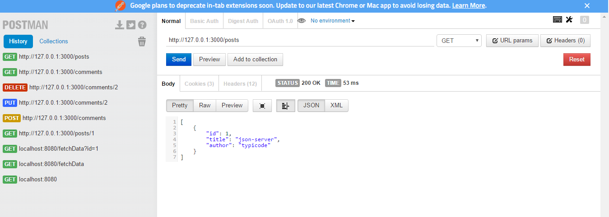

## 操作步骤
  1. 新建一个`json`文件，`db.json`

      ```
      {
        "posts": [
          { "id": 1, "title": "json-server", "author": "typicode" }
        ],
        "comments": [
          { "id": 1, "body": "some comment", "postId": 1 }
        ],
        "profile": { "name": "typicode" }
      }
      ```

  2. 新建一个`package.json`文件

      ```
      $ npm init
      ```

  3. 安装`json-server`

      ```
      $ npm install -S json-server
      ```

  4. 打开`package.json`，在`scripts`字段添加一行

      ```
      "scripts": {
        "server": "json-server db.json"
      }
      ```

  5. 执行如下命令，启动服务

      ```
      $ npm run server
      ```

  6. 打开`chrome`中的`postman`
  

  7. 发送GET请求

      ```
      http://127.0.0.1:3000/posts
      http://127.0.0.1:3000/posts/1
      ```
  查询结果

  8. 发送POST请求

      ```
      http://127.0.0.1:3000/comments
      // 数据体BODY选择`x-www-form-urlencoded`编码，填写如下字段
      body: "hello world"
      postId: 1
      ```
  发送请求后通过GET请求查询结果

  9. 发送PUT请求

      ```
      http://127.0.0.1:3000/comments/2
      // 数据体BODY选择`x-www-form-urlencoded`编码，填写如下字段
      body: "hello react"
      ```
  发送请求后通过GET请求查询结果

  10. 发送DELETE请求

      ```
      http://127.0.0.1:3000/comments/2
      ```
  发送请求后通过GET请求查询结果

